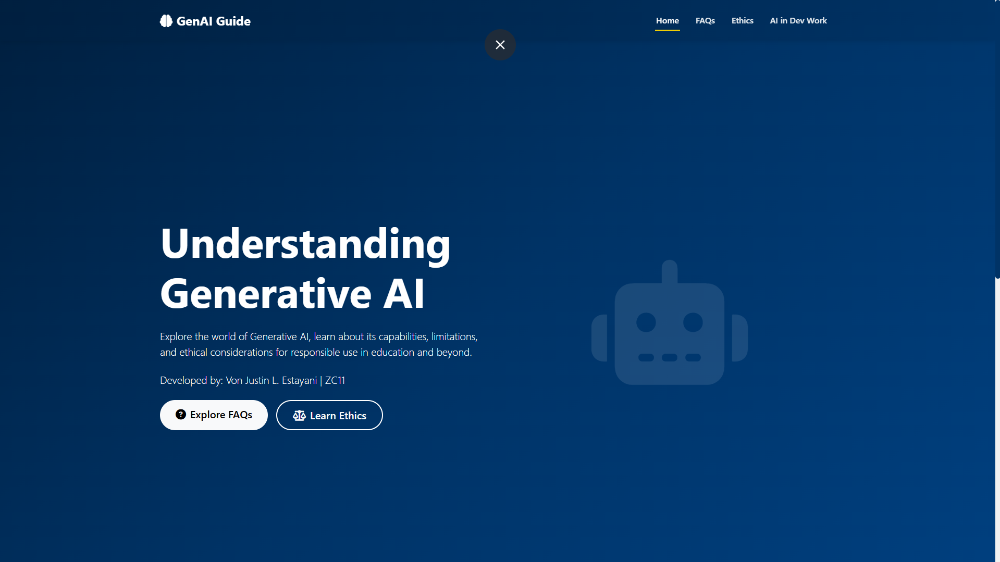
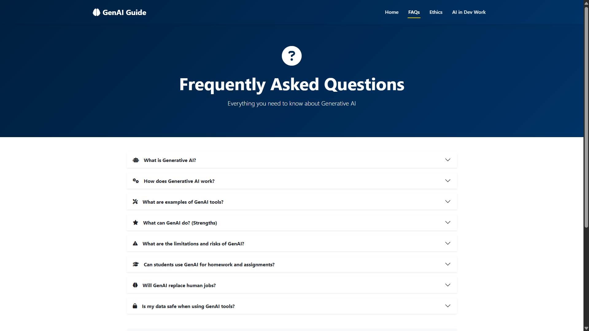
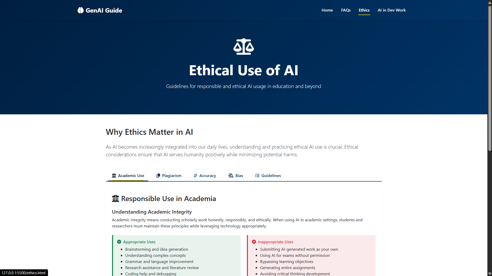
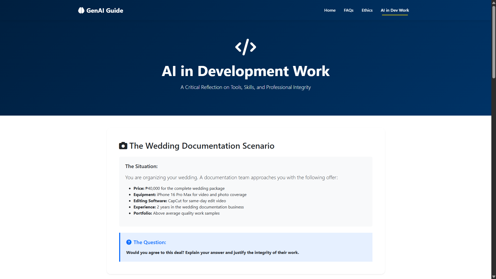

# GenAI FAQs & Ethical Use of AI

## Short Overview

This is a comprehensive, educational website designed to help students, researchers, and general users understand Generative AI (GenAI), its capabilities, limitations, and ethical considerations. The website provides clear, accessible information about responsible AI use, particularly in academic and professional contexts.

## Features

### 🏠 Landing/Home Page (index.html)
- Introduction to Generative AI
- Quick navigation to all major sections
- Feature cards highlighting key topics

### ❓ FAQ Section (faq.html)
- Comprehensive accordion-style FAQs
- Properly cited references

### ⚖️ Ethical Use of AI (ethics.html)
- Tabbed interface covering five major topics:
  1. **Academic Use**
  2. **Plagiarism**
  3. **Accuracy**
  4. **Bias**
  5. **Guidelines**
- Properly cited references

### 💻 Analogy on the Use of AI in Dev Work (article.html)
- Analogy comparing wedding photographers using consumer tools to developers using AI
- Critical analysis of "vibe coders" and AI-assisted development
- Discussion of integrity, creativity, and skill level
- Balanced perspective on tool usage vs. professional expertise
- Reflection on what truly defines professional competence

## Technologies Used

- **HTML5**: Semantic markup for all pages
- **CSS3**: Custom styling with animations and transitions\
- **Bootstrap 5.3.2**: Responsive grid system, components, and utilities
- **Font Awesome 7.1.0**: Icons throughout the site

## Frameworks and Libraries

| Technology | Version | Purpose |
|------------|---------|---------|
| Bootstrap | 5.3.8 | Responsive framework, UI components |
| Font Awesome | 7.1.0 | Icon library |
| CSS3 | - | Custom styling, animations, transitions |

## File Structure

```
project-root/
│
├── index.html              # Landing/Home Page
├── faq.html                # FAQ Section
├── ethics.html             # Ethical Use of AI Page
├── article.html            # Analogy on the Use of AI in Dev Work
├── README.md               # Details about the Project
│
└── assets/
    ├── css/
    │   └── style.css       # Custom CSS styles
    └── img/                # Images (screenshots of the website)
```

## How to Run the Project

### Option 1: Direct Browser Opening (Simplest Method)
1. Download or clone this repository
2. Navigate to the project folder
3. Double-click or open `index.html` in any modern web browser (Chrome, Firefox, Safari, Edge)
4. Navigate through the site using the top navigation menu

### Option 2: Using VS Code Live Server:
1. Install "Live Server" extension in VS Code
2. Right-click on `index.html`
3. Select "Open with Live Server"
4. Browser will open automatically

### Option 3: Online Deployment

The website is ready to deploy to any static hosting service:
- **GitHub Pages**: Push to GitHub and enable Pages in repository settings
- **Netlify**: Drag and drop the project folder at netlify.com
- **Vercel**: Import from GitHub or upload directly at vercel.com

## Deployment Links
- **Live Demo**: [https://vonjjustin.github.io/GenAI-FAQs-Ethical-Use-of-AI/](https://vonjjustin.github.io/GenAI-FAQs-Ethical-Use-of-AI/)
- **Live Demo**: [gen-ai-faqs-ethical-use-of-ai.vercel.app](https://gen-ai-faqs-ethical-use-of-ai.vercel.app)

### Deployment Instructions:
#### GitHub Pages:
1. Push code to GitHub repository
2. Go to repository Settings → Pages
3. Select main branch as source
4. Site will be available at `https://username.github.io/repository-name`
   
#### Vercel:
1. Create account at vercel.com
2. Import GitHub repository or upload files
3. Automatic deployment with custom domain support

## Screenshots

### Landing/Home Page


### FAQ Section


### Ethical Use of AI Page


### Analogy on the Use of AI in Dev Work

